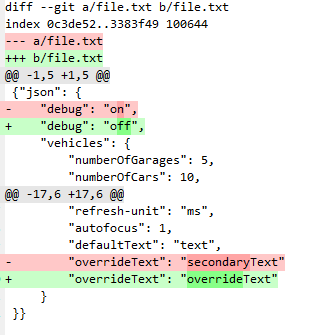

# Task description

We have two modifications in a file.

We want to commit them separately:
* First commit should contain change of debug property.
* Second commit should contain change of overrideText property.