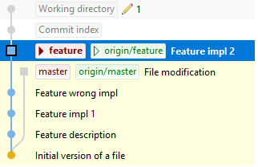
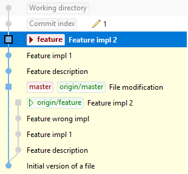

# Task description

Currently git history looks like this:

The goal of this task is to rewrite history in such a way that:

* master shoud be a base commit of branch "feature" 
* we want to get rid of a commit with commit message: Feature wrong impl
* file.txt should be in staging area with content: Master and feature modification

This is what we want to achieve:

